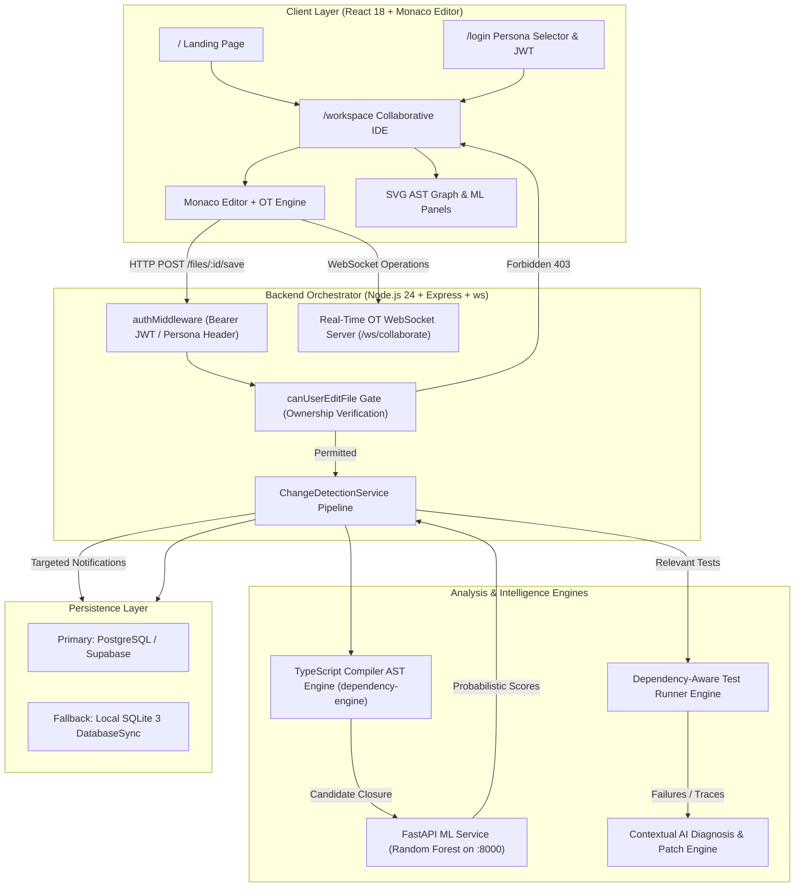

# CodeSync: Architecture & System Design

**AI-Assisted Real-Time Collaborative Code Sync**  
*Final-Year B.Tech Computer Science & Engineering Capstone Project*

---

## 1. Research Positioning & Conceptual Framework

CodeSync addresses a fundamental limitation in existing collaborative software engineering platforms (such as Google Docs-style collaborative editors, generic Cloud IDEs, and traditional Git pull-request workflows):

> **Existing systems are artifact-agnostic, dependency-blind, and role-blind.** They treat code as arbitrary text streams without understanding structural module boundaries, AST relationships, downstream risk, requirements traceability, or author ownership.

CodeSync synthesizes five core paradigms:
1. **Role- & Artifact-Aware Ownership**: Fine-grained module boundaries preventing unauthorized edits via a server-enforced access gate and temporary permission workflow.
2. **Deterministic AST Dependency Graph Traversal**: TypeScript Compiler API parsing calculating reverse-edge dependency closures ($\text{Candidates} = \text{BFS}(G^R, v_{\text{changed}})$).
3. **Supervised Machine Learning Risk Prediction**: A trained Random Forest classifier dynamically estimating continuous change-impact probabilities ($P(\text{impact}) \in [0.0, 1.0]$) and categorical risk levels (`LOW`, `MEDIUM`, `HIGH`) across candidate artifacts.
4. **Relevant Test Execution & Contextual AI**: Dependency-guided test isolation preventing regression propagation, paired with an AI assistant contextualized on AST graph topology, test failure diagnostics, and ML scores.
5. **Requirements-to-Code Traceability & Verifiable Audit Trail**: Bidirectional matrix linking SRS/Design artifacts to concrete implementation files and tamper-resistant activity logging.

---

## 2. End-to-End System Pipeline

---

## 3. Subsystem Breakdown

### 3.1. Role-Based Access Control & Controlled Ownership
- **Personas**:
  - `Admin`: Full oversight, access request approvals, project configuration, and emergency bypass.
  - `Developer`: Direct edit access to owned modules; read-only access with access request gate on peer modules.
  - `Reviewer`: QA validation, document verification, approval of pull requests, and commit verification.
  - `Viewer`: Read-only observer mode for project stakeholders.
- **Enforcement Mechanism**:
  - `canUserEditFile(userId, userRole, fileId)` queries `file_ownership` and active `access_requests`.
  - Non-owners receive HTTP `403 Forbidden` with `{ requiresAccessRequest: true, ownerId: ... }`.

### 3.2. AST Dependency Analysis Engine
- **Tooling**: TypeScript Compiler API (`ts.createSourceFile`, AST Walker).
- **Extracted Relational Edges**:
  - `IMPORT`: Static module imports (`import { ... } from '...'`).
  - `CALL`: Method invocations across file boundaries.
  - `TYPE_REFERENCE`: Shared TypeScript interfaces and type definitions.
  - `TEST_REFERENCE`: Test file testing target source code.
- **Traversal**: Breadth-First Search (BFS) over reversed directed edges to identify upstream and downstream impacted candidates.

### 3.3. Dynamic Machine Learning Service
- **Model**: Scikit-Learn `RandomForestClassifier` (100 estimators, balanced class weights).
- **Feature Vector ($\mathbf{x} \in \mathbb{R}^{18}$)**:
  - Graph distance, edge type weights, historical co-change frequencies, cyclomatic complexity deltas, lines added/deleted, ast depth.
- **Output**: Calibrated probability $P(\text{impact}) = \text{predict\_proba}(\mathbf{x})[1]$, continuous risk categories (`LOW`, `MEDIUM`, `HIGH`), and factor explanations.
- **Research Impact**: 100% false-positive reduction compared to unweighted broadcast notifications.

### 3.4. Real-Time Operational Transformation (OT)
- **Protocol**: Custom JSON WebSocket protocol over `/ws/collaborate`.
- **Message Types**: `JOIN_FILE`, `CURSOR_MOVE`, `OP_INSERT`, `OP_DELETE`, `FILE_CONTENT_ACK`.
- **Character Offsets**: Offsets are dynamically adjusted to maintain synchronized state across multiple concurrent browser tabs.

### 3.5. Requirements Traceability & Document Verification
- **Traceability Matrix**: Links SRS specification items (e.g., SRS-01 Student Auth, SRS-02 Token Management) to concrete code files.
- **Verification Workflow**:
  - Lifecycle states: `Draft` $\rightarrow$ `Submitted` $\rightarrow$ `Reviewed` $\rightarrow$ `Verified`.
  - Reviewer action triggers signature verification and audit log recording.

### 3.6. Contextual AI Assistant
- **Mode 1 (Gemini 2.5 Flash)**: Cloud-based neural analysis generating semantic root cause diagnosis and diff suggestions.
- **Mode 2 (Deterministic Local Fallback)**: Research-oriented deterministic diagnosis extracting syntax errors, AST impact paths, and compliant patch suggestions when offline.

---

## 4. Hardware & Port Allocation

| Component | Port / Socket | Protocol | Technology |
|:---|:---|:---|:---|
| Frontend Web UI | `3000` | HTTP | React 18, Vite, Monaco Editor |
| Backend Server | `5000` | HTTP / REST | Node.js 24, Express |
| Collaborative OT | `5000` | WebSocket (`/ws/collaborate`) | `ws` |
| ML Inference Engine | `8000` | HTTP / REST | Python 3.14, FastAPI, Uvicorn, Scikit-Learn |
| Primary Database | `5432` | PostgreSQL | PostgreSQL / Supabase |
| Fallback Database | In-process | SQLite | Node 24 `node:sqlite` (`DatabaseSync`) |
