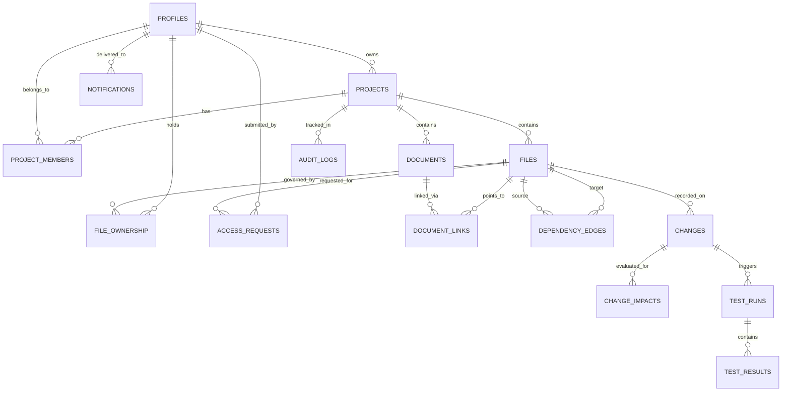

# CodeSync: Database Architecture & Schema Reference

CodeSync provides a dual-database architecture:
1. **Primary Database:** PostgreSQL / Supabase with Row Level Security (RLS) policies.
2. **Local Fallback Database:** Embedded SQLite (Node.js built-in `node:sqlite`) for zero-configuration local development.

---

## 1. Entity-Relationship Overview

---

## 2. Key Entities

- `profiles`: User accounts with role assignments (`Admin`, `Developer`, `Reviewer`, `Viewer`).
- `projects`: Container container for repository files, members, and configurations.
- `files`: File tree entities with paths, modules, contents, and ownership relations.
- `file_ownership`: Persistent module ownership mapping files to developers.
- `access_requests`: Formal permission delegation requests with reasons, approvers, and decisions.
- `documents`: Specifications and requirements (`doc_type`: `requirement`, `spec`, etc.).
- `document_links`: Traceability links binding requirements to code symbols.
- `dependency_edges`: AST relationship edges (`relationship_type`, `dependency_distance`, `metadata`).
- `changes`: Fine-grained change events (`lines_added`, `lines_deleted`, `functions_changed`, `diff`).
- `change_impacts`: Machine learning predicted impacts on candidate files (`impact_probability`, `risk_level`, `explanation`).
- `test_runs` & `test_results`: Execution records for relevant test runs (`status`, `duration_ms`, `error_message`, `stack_trace`).
- `notifications`: Impact alerts and access requests targeted directly to artifact owners.
- `audit_logs`: Immutable security and operation audit trail.
